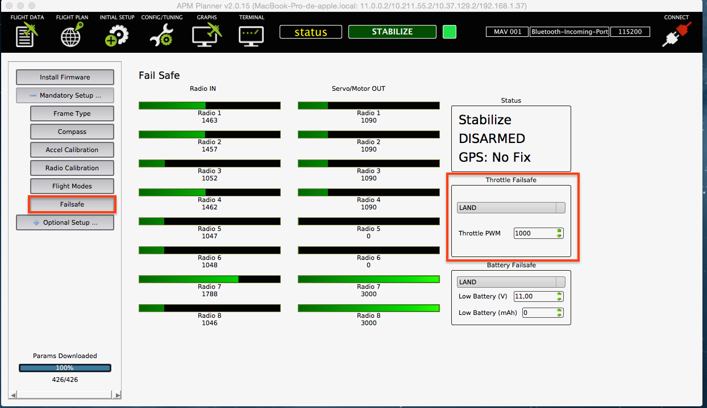
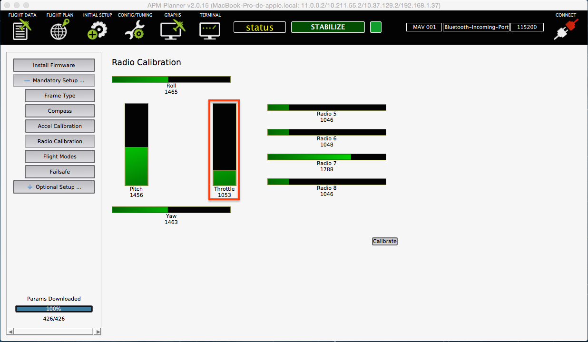
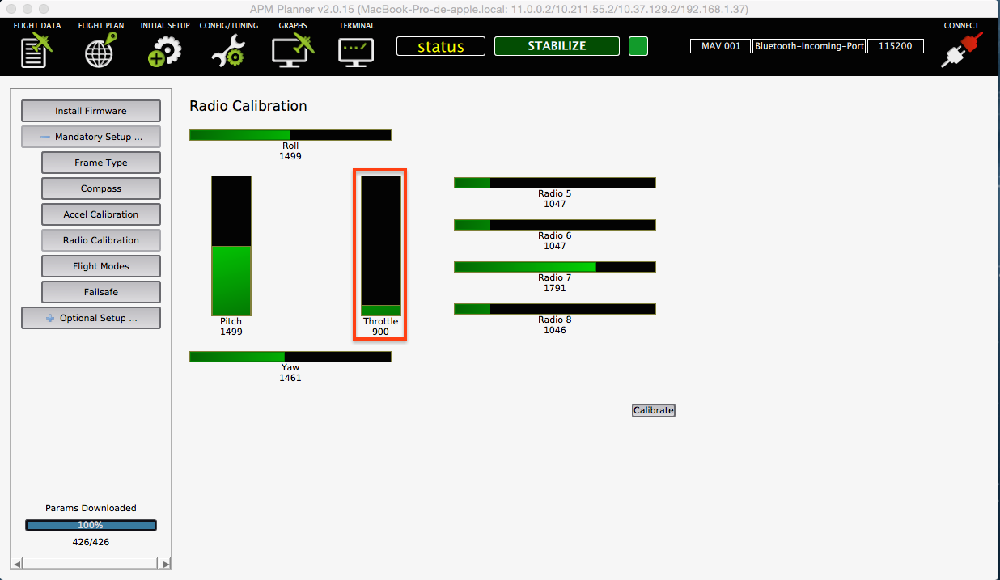
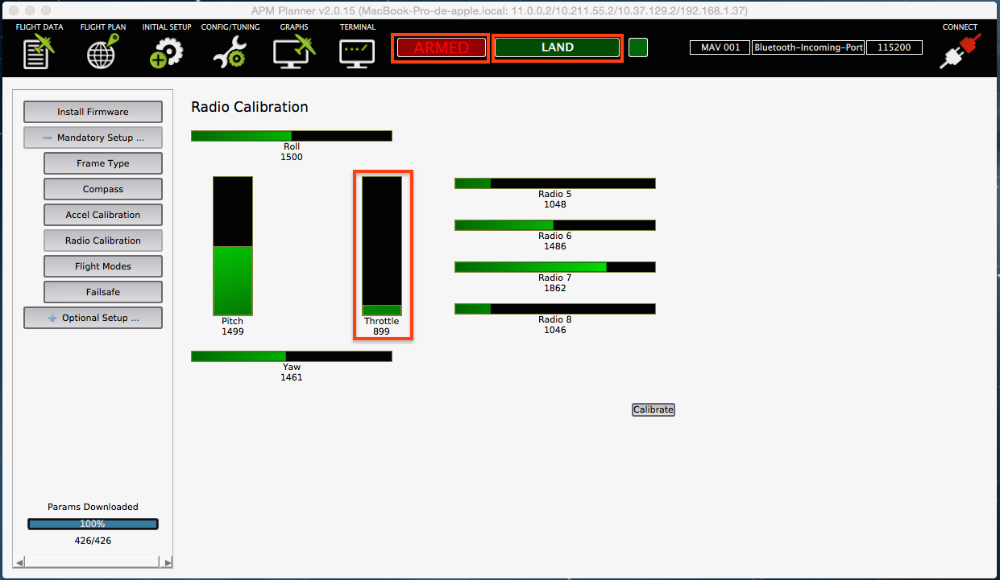

#Failsafe

	A fail-safe or fail-secure device is one that, in the event of a specific type of failure,
	responds in a way that will cause no harm, or at least a minimum of harm, to other devices or
	danger to personnel.

Taking this definition as a start point, drones, obviously, also needs security measurements. You could configure [Erle-Copter](http://erlerobotics.com/blog/erle-copter/) to enable failsafes. In this section, we will explain how to activate some of them (the most meaningful ones). For more info check [this](http://copter.ardupilot.com/wiki/configuration/) site.

---
*Note: As user might not have GPS, this section will show how to setup failsafes using **land** mode*

---

###Radio Failsafe

[Erle-Copter](http://erlerobotics.com/blog/erle-copter/) supports Return-To-Launch/Land in cases where contact between the Pilot’s RC transmitter and the flight controller’s receiver is lost.

####When the failsafe will trigger

If enabled and set-up correctly the radio failsafe will trigger if:

+ The pilot turns off the RC transmitter
+ The vehicle travels outside of RC range (usually at around 500m ~ 700m)
+ The receiver loses power (unlikely)
+ The wires connecting the receiver to the flight controller are broken (unlikely). 

####Set-up for No-Signal method

Follow the next steps to enable it:

+ Connect your flight controller to the mission planner and select Initial Setup >> Mandatory Hardware >> Failsafe.
+ Set the **Throttle Failsafe** Option to **LAND** to force the vehicle to Land immediately if it loses RC contact. Because the throttle is not pulled low, there is no need to set the “FS Pwm” value.

####Testing

Make the next tests in order to verify is working fine:

+ Ensure the minimum value of the RC and RC off PWM value are different: Turn on the RC with the **throttle** to the minimum, enter into the **RC calibration** window and check the value:

Now turn off the RC and check that the value descends:

+ Switch to **stabilize mode**, arm your motors but keep your throttle at zero. Turn off your transmitter. The motors should disarm immediately (red led will start flashing, **DISARMED** will be displayed in the Mission Planner’s Flight Data screen).

+ Switch to **stabilize mode**, arm your motors and raise your throttle to the mid point. Turn off your transmitter. The Flight Mode should switch to **LAND**.

Notice that the value of the **throttle** is lower than the minimum value (~1053) when the RC is **on** and that **Erle-Copter** has changed to **Land** mode.

